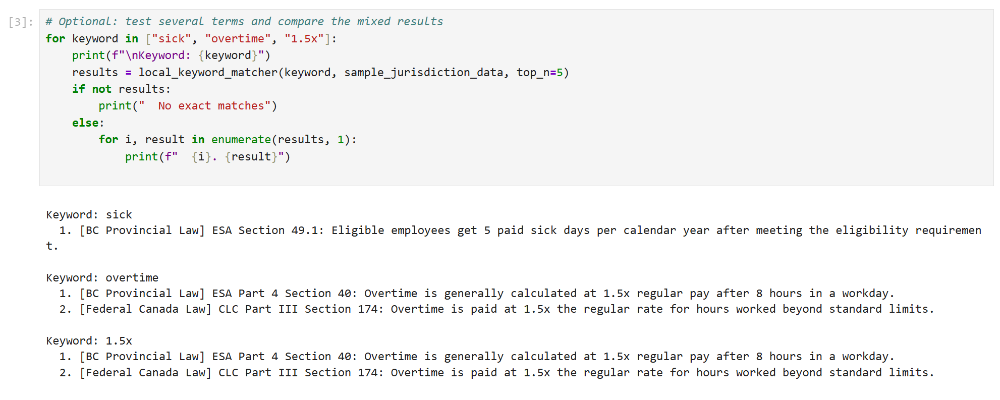
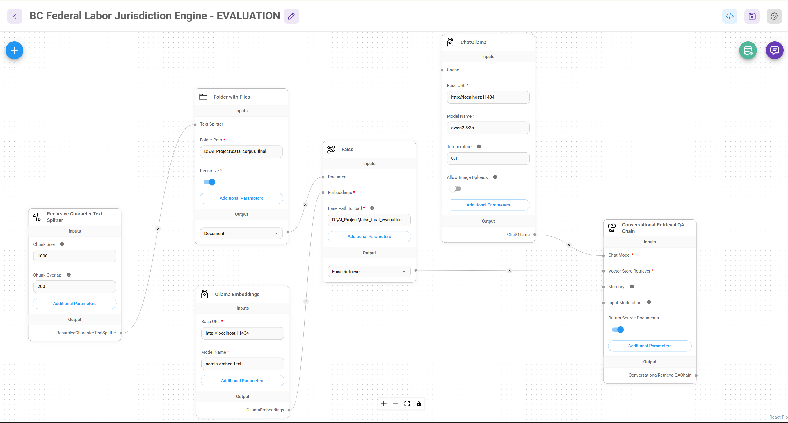
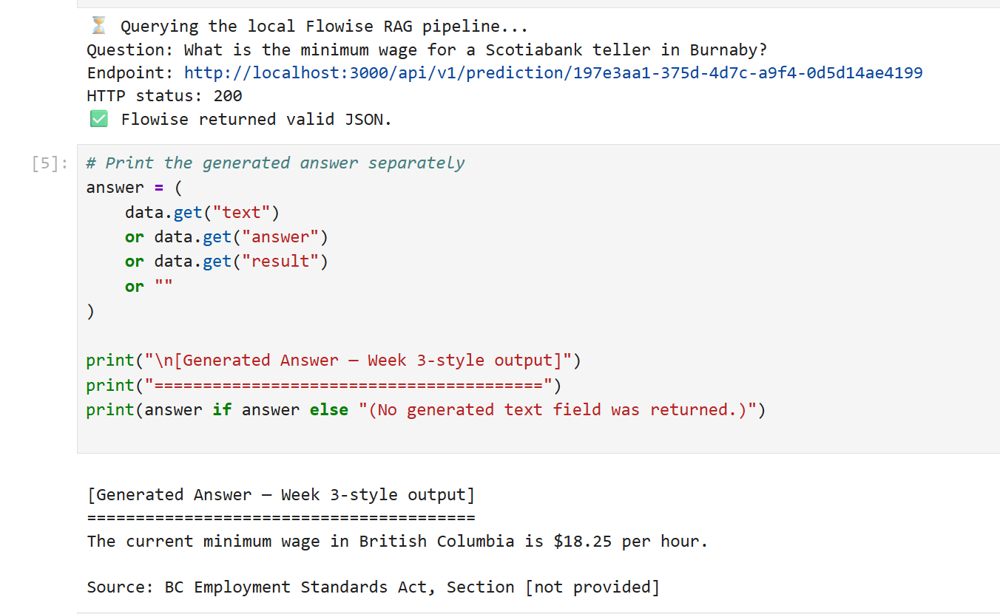
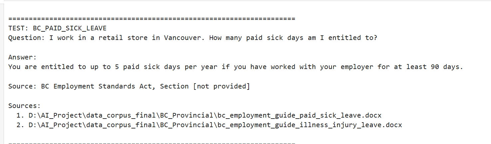
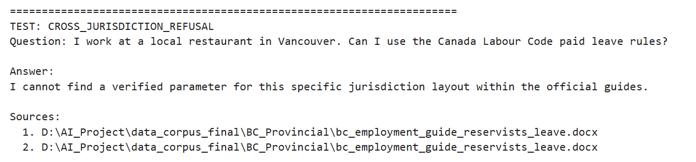
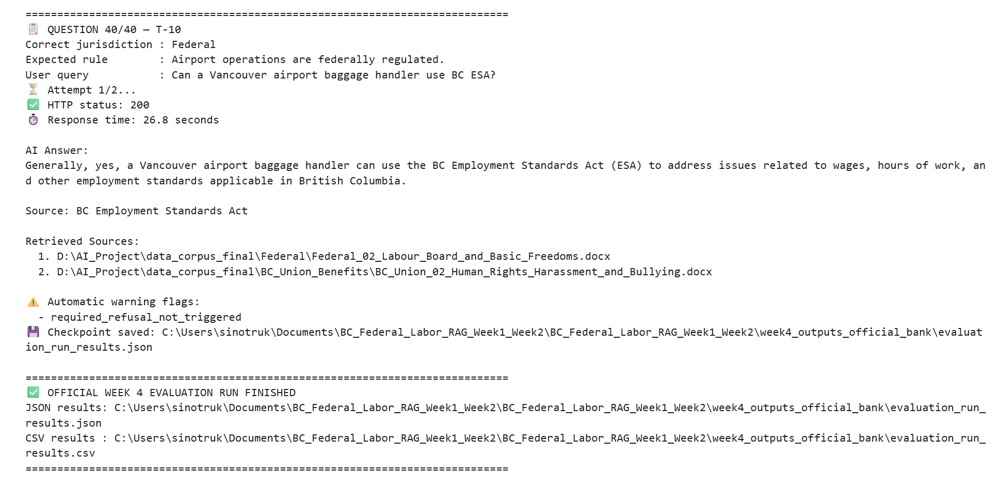

# BC Federal Labor Jurisdiction RAG Assistant

## Project Overview

This repository contains the Week 1–4 development and evaluation workflow for a local Retrieval-Augmented Generation (RAG) chatbot designed to distinguish between **British Columbia provincial employment rules** and **Canadian federal labour rules**.

The system was developed with:

- **Flowise** for the visual RAG workflow
- **Ollama** for fully local model hosting
- **qwen2.5:3b** as the local answer-generation model
- **nomic-embed-text** as the local embedding model
- **FAISS** as the local vector store
- **Python and Jupyter Notebook** for retrieval verification, answer-generation tests, and bulk evaluation

The chatbot is an educational information-retrieval prototype. It is not a substitute for professional legal advice.

---

## Project Objectives

The project evaluates whether a local RAG system can:

1. Retrieve relevant labour-law passages from the correct jurisdiction.
2. Distinguish between BC Provincial and Federal worker contexts.
3. Generate answers grounded in the retrieved documents.
4. provide a source or citation line with the answer.
5. Refuse unsupported or jurisdictionally conflicting requests.
6. Record retrieval, generation, citation, and refusal results for review.

---

## Repository Structure

```text
BC-Federal-Labor-RAG-Assistant/
│
├── README.md
├── .gitignore
│
├── week1_baseline_search.ipynb
├── week2_rag_pipeline.ipynb
├── week3_generation_prototype.ipynb
├── week4_evaluation_suite_official_question_bank.ipynb
│
├── BC Federal Labor Jurisdiction Engine - EVALUATION Chatflow.json
├── Question Bank - Evaluation Spreadsheet.xlsx
├── Flowise Setup Guide(Updated).docx
│
├── week4_outputs_official_bank/
│   ├── evaluation_run_results.json
│   ├── evaluation_run_results.csv
│   └── evaluation_scorecard.csv
│
├── screenshots/
│   ├── 01_week1_keyword_baseline.png
│   ├── 02_final_flowise_canvas.png
│   ├── 03_week2_retrieval_result.png
│   ├── 04_week3_generated_answer.png
│   ├── 05_week3_exact_refusal.png
│   └── 06_week4_evaluation_completed.png
│
└── data_corpus/
    ├── BC_Provincial/
    ├── Federal/
    └── BC_Union_Benefits/
```

The legal-document corpus may be kept locally rather than uploaded when file size, licensing, or repository limits make public distribution inappropriate.

Development-only files are not part of the final submission. Examples include temporary notebooks, failed test outputs, old Chatflow exports, FAISS index files, Jupyter checkpoints, Ollama model files, and `node_modules`.

---

# Weekly Development Workflow

## Week 1 — Keyword Search Baseline

**Notebook:** `week1_baseline_search.ipynb`

Week 1 establishes a traditional keyword-search baseline before introducing vector retrieval or answer generation.

The notebook:

- Defines a case-insensitive `local_keyword_matcher()` function.
- Searches sample BC Provincial and Federal labour-law passages line by line.
- Returns the first matching passages.
- Demonstrates why exact keyword matching is unreliable when both jurisdictions contain similar terms such as sick leave or overtime.

### Main Lesson

A keyword search can find matching words, but it does not reliably understand:

- worker jurisdiction;
- legal context;
- document authority;
- whether a BC or Federal rule applies.

Week 1 does not require Flowise or Ollama.

---

## Week 2 — Retrieval Pipeline Verification

**Notebook:** `week2_rag_pipeline.ipynb`

Week 2 connects Python to the local Flowise Chatflow and verifies that the retrieval pipeline returns source documents.

The notebook:

- Checks whether Flowise and Ollama are available.
- Sends a test question to the Flowise Prediction API.
- Requests retrieved source documents.
- Prints the generated response, source paths, and retrieved text previews.
- Reviews whether the correct jurisdiction appears in the retrieved sources.

### Week 2 Interpretation

The API and retrieval workflow operated successfully and returned HTTP status `200`.

The Federal banking test also revealed an important system limitation: a Federal bank query could retrieve BC Provincial minimum-wage documents. This result is retained as evidence of **wrong-jurisdiction retrieval**, rather than being presented as a correct Federal answer.

---

## Week 3 — Local Answer Generation Prototype

**Notebook:** `week3_generation_prototype.ipynb`

Week 3 adds local answer generation through the Flowise Prediction API.

The notebook verifies:

- Flowise connectivity;
- Ollama connectivity;
- availability of `qwen2.5:3b`;
- availability of `nomic-embed-text`;
- generated answer text;
- returned source-document metadata;
- basic jurisdiction, citation, and refusal behaviour.

The prototype includes scenarios covering:

- a BC Provincial employment-rule question;
- a Federal banking question;
- a cross-jurisdiction question intended to activate the fallback response.

### Week 3 Findings

The BC scenario and exact fallback behaviour were successfully demonstrated. However, the Federal banking scenario continued to show BC-source contamination. This confirms that the generation workflow is operational while jurisdiction-aware retrieval remains imperfect.

---

## Week 4 — Official Question Bank Evaluation

**Notebook:** `week4_evaluation_suite_official_question_bank.ipynb`

Week 4 performs bulk testing with the official team Question Bank.

The benchmark contains:

- **15 Federal questions**
- **15 BC Provincial questions**
- **10 trick or jurisdiction-conflict questions**
- **40 questions in total**

The notebook:

- Sends each question to the local Flowise Prediction API.
- Uses an independent session ID for each question.
- Records response time and HTTP status.
- Stores the generated answer.
- Stores retrieved source paths and metadata.
- Saves a checkpoint after every question.
- Classifies retrieved sources as Federal, BC Provincial, or Unknown.
- Generates automatic diagnostic warning flags.
- Creates a manual scoring spreadsheet for human review.

### Week 4 Output Files

```text
week4_outputs_official_bank/
├── evaluation_run_results.json
├── evaluation_run_results.csv
└── evaluation_scorecard.csv
```

The current 40-question run is retained as a **reproducibility check** of the local Flowise API. All 40 requests completed successfully, with an average successful response time of approximately **31.89 seconds**.

The blank manual scorecard generated by this reproduction run does not replace the original completed team evaluation spreadsheet.

---

# System Architecture

```text
User Question
     │
     ▼
Python / Jupyter Notebook
     │
     ▼
Flowise Prediction API
     │
     ▼
Jurisdiction and Prompt Guardrails
     │
     ▼
FAISS Vector Retriever
     │
     ▼
BC Provincial / Federal / Union Document Corpus
     │
     ▼
Ollama qwen2.5:3b
     │
     ▼
Generated Answer + Source Documents
```

The system is designed to remain local. The legal corpus, embeddings, vector index, and model inference are processed on the user's machine.

---

# Local Configuration

## Core Services

| Component | Local Configuration |
|---|---|
| Flowise | `http://localhost:3000` |
| Ollama | `http://localhost:11434` |
| Generation model | `qwen2.5:3b` |
| Embedding model | `nomic-embed-text` |
| Vector store | FAISS |
| Temperature | `0.1` |
| Chunk size | `1000` |
| Chunk overlap | `200` |
| Retriever Top K | `2` |

Example development paths:

```text
Corpus:
D:\AI_Project\data_corpus_final

FAISS index:
D:\AI_Project\faiss_final_evaluation
```

These paths are machine-specific and must be changed when the repository is run on another computer.

---

# Installation and Setup

## 1. Install the Required Software

Install:

- Python 3
- Jupyter Notebook or JupyterLab
- Node.js LTS
- Flowise
- Ollama

Install the Python packages used by the notebooks:

```bash
pip install requests pandas jupyter
```

## 2. Download the Ollama Models

```bash
ollama pull qwen2.5:3b
ollama pull nomic-embed-text
```

Confirm the models:

```bash
ollama list
```

## 3. Start Flowise

```bash
npx flowise start
```

Open:

```text
http://localhost:3000
```

## 4. Import the Chatflow

In Flowise:

1. Select **Import Chatflow**.
2. Import `BC Federal Labor Jurisdiction Engine - EVALUATION Chatflow.json`.
3. Confirm the Ollama base URL is `http://localhost:11434`.
4. Confirm the generation model is `qwen2.5:3b`.
5. Confirm the embedding model is `nomic-embed-text`.
6. Update the corpus folder and FAISS index paths.
7. Save the Chatflow.
8. Upsert the document corpus when required.

## 5. Update the Chatflow ID

After importing the Chatflow, copy the Chatflow ID from the Flowise URL.

Update the following line in the Week 2, Week 3, and Week 4 notebooks:

```python
CHATFLOW_ID = "YOUR_LOCAL_CHATFLOW_ID"
```

A Chatflow ID is local to a Flowise installation. Another team member may receive a different ID after importing the same JSON file.

---

# Running the Notebooks

Run the notebooks in this order:

```text
1. week1_baseline_search.ipynb
2. week2_rag_pipeline.ipynb
3. week3_generation_prototype.ipynb
4. week4_evaluation_suite_official_question_bank.ipynb
```

## Week 1

Week 1 can be run independently because it uses only local Python sample text.

## Week 2 and Week 3

Before running:

- start Ollama;
- start Flowise;
- confirm the correct Chatflow ID;
- confirm the corpus and vector store are available.

## Week 4

For a new complete 40-question run:

```python
RUN_LIMIT = None
RESUME_EXISTING_RESULTS = False
```

To continue from saved successful results:

```python
RESUME_EXISTING_RESULTS = True
```

For a quick technical test:

```python
RUN_LIMIT = 3
```

A full Week 4 run can take a significant amount of time on a local CPU.

The saved Week 4 results can be reloaded and reclassified without rerunning all 40 API requests. The diagnostics-refresh and scorecard cells operate on the saved JSON file.


## Selected Project Evidence

### Week 1 — Keyword Baseline


### Final Flowise Architecture


### Week 2 — Retrieval Verification


### Week 3 — Generated Answer


### Week 3 — Refusal Guardrail


### Week 4 — Completed Evaluation



---


# Evaluation Summary

## Official Team Evaluation

The official team metrics are based on the completed Question Bank evaluation spreadsheet.

| Metric | Result |
|---|---:|
| Retrieval Hit Rate | 28 / 40 = **70%** |
| Generation Faithfulness | 20 / 40 = **50%** |

Refusal performance was reviewed qualitatively because the earlier evaluation spreadsheet used a mixture of binary scores and `N/A` values. It should not be presented as a directly comparable percentage without first standardizing the scoring method.

## Reproduction Run

The current Week 4 notebook run is retained as a technical reproducibility check:

| Technical Check | Result |
|---|---:|
| Successful API requests | **40 / 40** |
| Average successful response time | **31.89 seconds** |

These technical execution results do not replace the official team evaluation scores.

---

# Known Limitations

The evaluation identified several recurring limitations:

1. **Wrong-jurisdiction retrieval**  
   Some Federal questions retrieved BC Provincial documents, particularly banking and telecom scenarios.

2. **Retrieval collisions**  
   Questions about topics appearing in both jurisdictions could retrieve one Federal and one BC source.

3. **Generation inconsistency**  
   The local model could retrieve a relevant passage but still generate an incomplete or incorrect rule.

4. **Citation inconsistency**  
   A generated source line could be missing, incomplete, or inconsistent with the retrieved documents.

5. **Refusal inconsistency**  
   The model sometimes explained the correct jurisdiction instead of returning the required exact fallback sentence.

6. **Local-model variability**  
   Answers can vary slightly across runs even when the Chatflow, corpus, and question remain unchanged.

These limitations are retained in the project evidence rather than hidden, because they are important findings of the RAG evaluation.

---

# Reproducibility Notes

To reproduce the same environment as closely as possible, keep the following consistent:

- exported Flowise Chatflow version;
- legal-document corpus version;
- FAISS index;
- chunk size and overlap;
- retriever Top K;
- Ollama model names;
- model temperature;
- official 40-question benchmark;
- scoring rubric.

Do not combine metrics from different Chatflow versions, corpus versions, or evaluation runs.

Absolute paths, Chatflow IDs, and local usernames should be reviewed before publishing the repository.

---

# Files Excluded from the Final Repository

The following files should not be committed:

```text
.ipynb_checkpoints/
node_modules/
faiss_final_evaluation/
*.faiss
*.pkl
*.tmp
.env
Ollama model files
temporary test notebooks
old Chatflow exports
failed experimental outputs
```

Example `.gitignore` entries:

```gitignore
.ipynb_checkpoints/
__pycache__/
*.pyc
.env
node_modules/
faiss*/
*.faiss
*.pkl
```

---

# Responsible Use

This chatbot is an academic prototype intended to support educational research into local RAG systems and jurisdiction-aware retrieval.

It does not provide legal representation, legal advice, or a guarantee that a retrieved rule is current or applicable to a specific person. Users should verify important employment-law questions with the appropriate official government source or a qualified professional.

---

## Final Submission Note

This repository contains the cleaned and reproducible final submission for the Week 1–4 project. Temporary development files, failed experiments, duplicate notebooks, old Chatflow versions, and local vector-index files are not included.

The Week 4 evaluation materials preserve both successful and unsuccessful cases. The official team evaluation spreadsheet remains the source of the reported retrieval and generation metrics, while the current Week 4 notebook run is retained as a separate reproducibility check.
